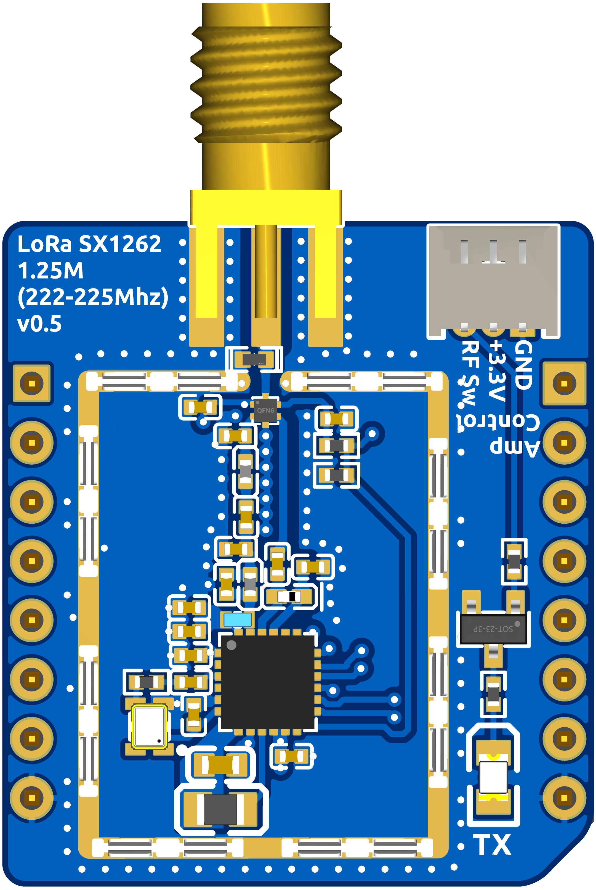
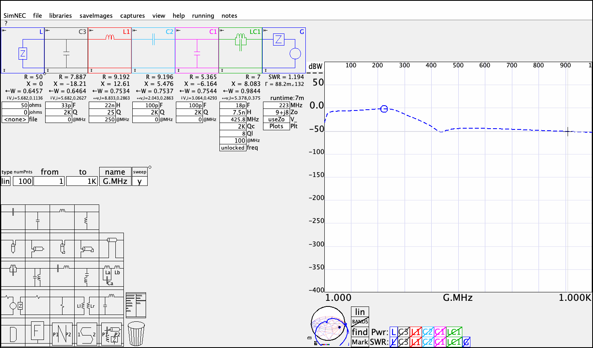

# 1.25 Meter (222–225 MHz) SX1262 mikroBUS Module

A mikroBUS-format LoRa add-on board built around the Semtech **SX1262**, front-end tuned for the US amateur **1.25 meter band (222–225 MHz)**. The board edge follows the mikroBUS pinout; solder a pin header (or castellated edge-mount) onto the module to plug it into a mikroBUS socket.

Being a standard mikroBUS module, it's compatible with MCU carrier boards such as [NomDeTom/Modular_MeshMess](https://github.com/NomDeTom/Modular_MeshMess).

---

## PCB

---

## Hardware Revisions

| Version | Directory | Notes |
|---------|-----------|-------|
| v0.5 | [v0.5/](v0.5/) | Current release |
| v0.2 | [v0.2/](v0.2/) — [README](v0.2/README.md) | Previous release (archived) |

### What's new in v0.5

- **RF shield clips** — eight SMD shield-clip contacts (U3–U10, footprint around the RF section) accept a snap-on shield can, letting the SX1262/RF-switch/filter area be enclosed for EMI containment and isolation. The clips are populated as part of JLCPCB assembly; the shield can itself is not included and must be sourced/fitted separately — see [RF Shield](#rf-shield) below for a source.
- **New CN2 connector** — the old unpopulated 2.54 mm breakout headers (H1/H2) have been replaced with a single 3-pin **Pico-Blade (JST 1.25 mm)** connector, `CN2`, broken out for external RF switch/amp control or manual bench control of the on-board RF switch during testing. CN2 is included in the assembly BOM by default but can be deselected for a small cost saving if unused. See [External RF Switch Control (CN2)](#external-rf-switch-control-cn2) below.

---

## Ordering PCBs from JLCPCB

The [v0.5/](v0.5/) directory contains all files needed to order assembled boards from [JLCPCB](https://jlcpcb.com).

### Files

| File | Purpose |
|------|---------|
| [Gerber_PCB1_2026-09-01.zip](v0.5/Gerber_PCB1_2026-09-01.zip) | Gerber files for PCB fabrication |
| [BOM_Board1_PCB1_2026-09-01.csv](v0.5/BOM_Board1_PCB1_2026-09-01.csv) | Bill of materials for JLCPCB SMT assembly |
| [PickAndPlace_PCB1_2026-09-01.csv](v0.5/PickAndPlace_PCB1_2026-09-01.csv) | Component placement file for SMT assembly |
| [ProPrj_SX1262 125CM v0.5_2026-09-01.epro](v0.5/ProPrj_SX1262%20125CM%20v0.5_2026-09-01.epro) | EasyEDA Pro source project |

### Steps

1. Go to [jlcpcb.com](https://jlcpcb.com) and click **Order Now**.
2. Upload `Gerber_PCB1_2026-09-01.zip`. JLCPCB will auto-detect the board dimensions.
3. Set your desired quantity and any stack-up/colour preferences (defaults are fine).
4. Enable **PCB Assembly (PCBA)** and select **Standard PCBA**.
5. Upload `BOM_Board1_PCB1_2026-09-01.csv` and `PickAndPlace_PCB1_2026-09-01.csv` when prompted.
6. Confirm component matches — every part, including the SX1262 itself, is sourced from LCSC and should resolve automatically.
7. Review the component placement preview, then proceed to checkout.

> **Note:** Unlike the other boards in this repo, the SX1262 here is placed as a bare die-down part (not a pre-made castellated module), so it **is** available for JLCPCB assembly — no hand soldering required for the RF section.

> **Note:** The mikroBUS edge (MB1) is an unpopulated through-hole pad set, not in the BOM — solder a pin header onto it to plug the board into a mikroBUS socket. CN2 (the Pico-Blade connector) and the eight RF shield clips (U3–U10) **are** in the BOM and populated by JLCPCB as part of assembly. If you don't need external RF switch control, CN2 can be deselected in the JLCPCB assembly BOM for a small cost saving — it isn't required for normal operation.

---

## mikroBUS Pinout

| mikroBUS Pin | Net | Function |
|---------------|-----|----------|
| AN | — | Not connected to the SX1262 (spare) |
| RST | NRESET | SX1262 reset |
| CS | NSS | SPI chip select |
| SCK | SCK | SPI clock |
| MISO | MISO | SPI MISO |
| MOSI | MOSI | SPI MOSI |
| 3.3V | VCC | 3.3 V supply in |
| GND | GND | Ground |
| GND | GND | Ground |
| 5V | — | Not connected to the SX1262 (spare) |
| SDA | — | Not connected |
| SCL | — | Not connected |
| TX | — | Not connected |
| RX | — | Not connected |
| INT | DIO1 (IRQ) | SX1262 interrupt |
| PWM | BUSY | SX1262 busy status |

---

## External RF Switch Control (CN2)

A 3-pin **Pico-Blade (JST 1.25 mm)** connector, silkscreened **"RF Sw Amp Control"**, breaks out the DIO2 net that drives the on-board SKY13453-385LF RF switch (and the TX indicator LED via Q1):

| CN2 Pin | Net | Function |
|---------|-----|----------|
| 1 | GND | Ground |
| 2 | +3.3V (VCC) | 3.3 V reference |
| 3 | DIO2 | RF switch control / TX-keying signal |

This replaces the unpopulated 2.54 mm H1/H2 breakout headers from v0.2. Because DIO2 is shared between the SX1262, the on-board RF switch driver, and CN2, this header can be used to:

- Drive an **external PA/amplifier's** enable or T/R control line in sync with the SX1262's TX/RX state.
- **Manually force** the on-board RF switch (and TX LED) into TX or RX for bench testing, independent of firmware.

> **Note:** Since DIO2 is a shared net, an external driver on CN2 pin 3 will also move the on-board RF switch and TX LED, and firmware-driven DIO2 activity will appear on CN2. Don't drive DIO2 from both the SX1262 and an external source at the same time.

---

## RF Shield

Eight SMD shield-clip footprints (**U3–U10**, `ICSRC6508SFR`) surround the RF section (SX1262, RF switch, and matching/filter network) and are all grounded to the board's GND plane. They accept a standard snap-on RF shield can/fence to enclose the RF circuitry for shielding and EMI containment. The clips are populated as part of JLCPCB assembly; the shield can itself is not in the BOM and must be sourced and fitted separately.

**Shield can source:** [AliExpress listing](https://www.aliexpress.us/item/3256804675396659.html) — pick the **20 x 15 x 3.0 mm** size to fit the board. Any shield of the same footprint (20 x 15 mm) that is **0.2 mm thick** will work, regardless of source.

---

## RF Front End

DIO2 drives the **SKY13453-385LF** SP3T RF switch through an L/C harmonic filter network (L7–L9, C24–C29) tuned for 222–225 MHz, feeding the SMA antenna jack (CN1). An **EZAEG2N50AX** TVS diode protects the antenna line.

### TX matching filter simulation

The output matching/harmonic filter (L1, C1–C3, LC1) was modeled in SimNEC against a 50 Ω load. The source project is [txsx1262v2.ssn](v0.5/txsx1262v2.ssn); a capture of the simulated response is [simnec0.2.gif](v0.5/simnec0.2.gif):

At the 223 MHz marker the network presents 9+j8 Ω to a 50 Ω source with SWR ≈ 1.19, and the response is a low-pass shape rolling off past ~400 MHz to attenuate harmonics.

---

## Schematic

[SCH_Schematic1_2026-09-01.pdf](v0.5/SCH_Schematic1_2026-09-01.pdf)

---

## License

This work is licensed under the **[CERN Open Hardware Licence Version 2 - Strongly Reciprocal (CERN-OHL-S v2)](../LICENSE.md)**.

You are free to use, study, modify, and distribute these designs and products made from them, provided that any Product embodying this Licensed Material — or Modifications of it — is made available under the same licence, with corresponding source made available per Section 5.
