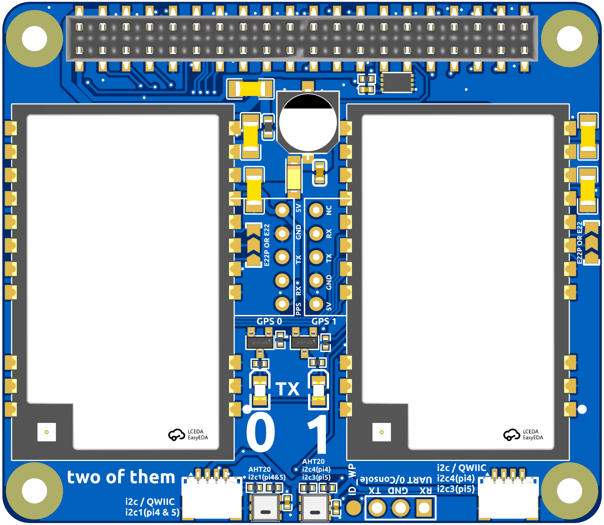
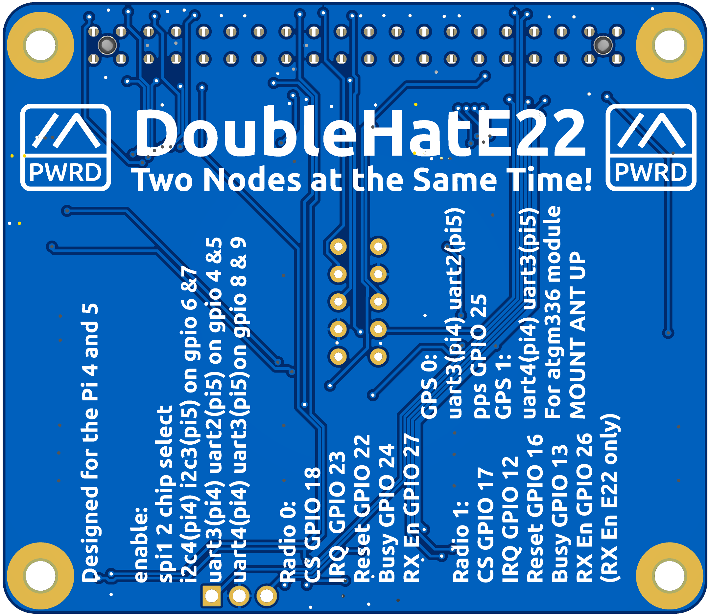

# Double Radio Pi HAT for Ebyte E22 / E22P Modules

This is a Raspberry Pi HAT for Ebyte E22 and E22P series SX1262-based LoRa modules (e.g. E22-900M30S, E22-900M33S, E22P-915M30S, E22P-868M30S), featuring dual LoRa radios, dual I2C ports with AHT20 temperature/humidity sensors, and a HAT+ compliant EEPROM.

---

## PCB

| Front | Rear |
|-------|------|
|  |  |

---

## Ordering PCBs from JLCPCB

The [PCB/](PCB/) directory contains all files needed to order assembled boards from [JLCPCB](https://jlcpcb.com).

### Files

| File | Purpose |
|------|---------|
| [BOM_Board1_PCB1_2026-06-24.zip](PCB/BOM_Board1_PCB1_2026-06-24.zip) | Gerber files for PCB fabrication |
| [BOM_Board1_PCB1_2026-06-24.csv](PCB/BOM_Board1_PCB1_2026-06-24.csv) | Bill of materials for JLCPCB SMT assembly |
| [PickAndPlace_PCB1_2026-06-24.csv](PCB/PickAndPlace_PCB1_2026-06-24.csv) | Component placement file for SMT assembly |

### Steps

1. Go to [jlcpcb.com](https://jlcpcb.com) and click **Order Now**.
2. Upload `BOM_Board1_PCB1_2026-06-24.zip`. JLCPCB will auto-detect the board dimensions.
3. Set your desired quantity and any stack-up/colour preferences (defaults are fine).
4. Enable **PCB Assembly (PCBA)** and select **Standard PCBA**.
5. Upload `BOM_Board1_PCB1_2026-06-24.csv` and `PickAndPlace_PCB1_2026-06-24.csv` when prompted.
6. Confirm component matches — all parts are sourced from LCSC and should resolve automatically.
7. Review the component placement preview, then proceed to checkout.

> **Note:** The 40-pin Pi HAT connector (J1) may appear at the wrong orientation in the JLCPCB placement preview. This is a visualisation quirk and will not affect the assembled board — the connector will be placed correctly.

> **Note:** The Ebyte E22 / E22P radio modules are **not available at JLCPCB** and must be soldered by the end user. The modules use a castellated SMD footprint suitable for reflow on a hotplate. Search for **"E22-900M30S"**, **"E22-900M33S"**, **"E22P-915M30S"**, or **"E22P-868M30S"** on AliExpress or order directly from Ebyte.
>
> If using the **E22-900M33S** (33 dBm variant), it is recommended to limit output power to 8 dBm via config — see the `SX126X_MAX_POWER` comment in the YAML files.

### Module selection jumpers

The board has two solder jumpers — **E22PE22** and **E22PE23** — that must be set to match the module variant installed.

| Module variant                                 | Jumper setting           |
|------------------------------------------------|--------------------------|
| Ebyte E22 (e.g. E22-900M30S / E22-900M33S)     | Bridge the **E22** pads  |
| Ebyte E22P (e.g. E22P-915M30S / E22P-868M30S)  | Bridge the **E22P** pads |

These jumpers configure the RF switch control lines for the different pinouts used by the two module families. Installing the wrong jumper setting will result in the RF switch not being driven correctly and severely degraded RF performance.

---

## Flashing the HAT+ EEPROM

The board uses a **BL24C32A** I2C EEPROM (U6) which must be programmed with the HAT+ configuration before the Pi will auto-load the device-tree overlay.

The pre-built EEPROM image is [doubleHatE22.eeprom](doubleHatE22.eeprom).

### Prerequisites

```bash
sudo apt install git i2c-tools
git clone https://github.com/raspberrypi/hats.git
cd hats/eepromutils
make
```

### Write protect jumper

The board has an `ID_WP` test point that ties the EEPROM write-protect pin high. **Bridge / short `ID_WP` to GND** before writing, then remove the bridge for normal operation.

### Flash the EEPROM

With the HAT seated on the Pi and write-protect disabled:

```bash
# Confirm the EEPROM is visible on the I2C ID bus (address 0x50)
sudo i2cdetect -y 0

# Flash the image
sudo ./eepflash.sh -w -f=/path/to/doubleHatE22.eeprom -t=24c32

# Verify the write
sudo ./eepflash.sh -r -f=/tmp/readback.eeprom -t=24c32
diff /path/to/doubleHatE22.eeprom /tmp/readback.eeprom && echo "OK"
```

After a successful write, power-cycle the Pi. The HAT+ overlay will load automatically and the EEPROM product name will appear in `dmesg`.

---

## Radio Configuration

Each radio has its own YAML config for use with Meshtastic / compatible firmware:

| File | Radio | Module | IRQ | Busy | Reset | RXen | SPI | I2C |
|------|-------|--------|-----|------|-------|------|-----|-----|
| [lora-hat-jessm33-doublehate22.yaml](lora-hat-jessm33-doublehate22.yaml) | Radio 0 | SX1262 | GPIO 23 | GPIO 24 | GPIO 22 | GPIO 27 | spidev1.0 | `/dev/i2c-1` |
| [lora-hat-jessm33-doublehate22-radio1.yaml](lora-hat-jessm33-doublehate22-radio1.yaml) | Radio 1 | SX1262 | GPIO 12 | GPIO 13 | GPIO 16 | GPIO 26 | spidev1.1 | `/dev/i2c-4` |

Both radios use `DIO2_AS_RF_SWITCH: true` and `DIO3_TCXO_VOLTAGE: 1.8 V`. GPS is not enabled by default but serial port paths (`/dev/ttyAMA3`, `/dev/ttyAMA4`) can be uncommented in the YAML files if GPS modules are attached.

---

## Schematic

[SCH_Schematic1_2026-06-24.pdf](SCH_Schematic1_2026-06-24.pdf)

---

## License

This work is licensed under **[Creative Commons Attribution-NonCommercial-ShareAlike 4.0 International (CC BY-NC-SA 4.0)](../../LICENSE.md)**.

**Commercial use of these designs is not permitted.** You are free to build, modify, and share them for personal and non-commercial purposes, provided you credit the original author and license any derivatives under the same terms.

[](../../LICENSE.md)
