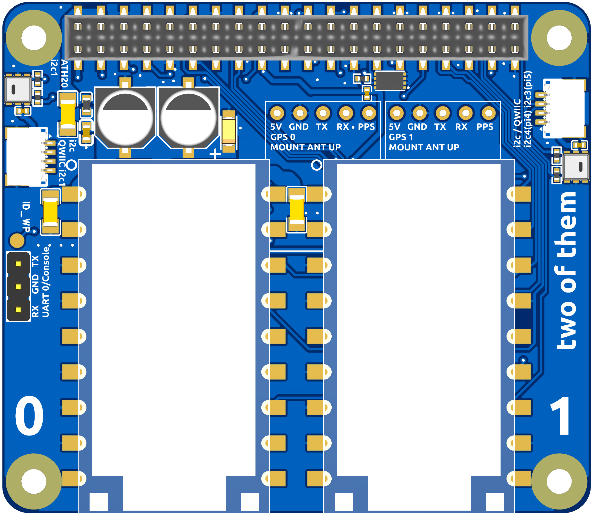
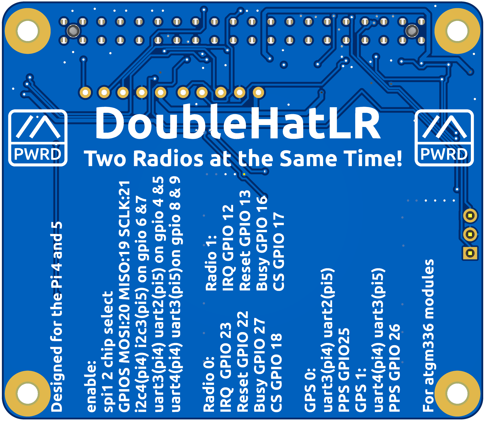

# Double Radio Pi Hat for NiceRF LR F33 Modules

This is a Raspberry Pi HAT for NiceRF 1–2 watt F33 LR1121 and LR2021 modules, featuring dual LoRa radios, dual GPS ports, dual I2C/AHT20 temperature-humidity sensors, and a HAT+ compliant EEPROM.

> [!WARNING]
> **The LR2021 module is not supported in any official Meshtastic release.** A custom build of `meshtasticd` is required. Use the code from [firmware PR #10567](https://github.com/meshtastic/firmware/pull/10567) and build from source.

---

## PCB

| Front | Rear |
|-------|------|
|  |  |

---

## Ordering PCBs from JLCPCB

The [PCB/](PCB/) directory contains all files needed to order assembled boards from [JLCPCB](https://jlcpcb.com).

### Files

| File | Purpose |
|------|---------|
| [Gerber_PCB1_2026-06-24.zip](PCB/Gerber_PCB1_2026-06-24.zip) | Gerber files for PCB fabrication |
| [BOM_Board1_PCB1_2026-06-24.csv](PCB/BOM_Board1_PCB1_2026-06-24.csv) | Bill of materials for JLCPCB SMT assembly |
| [PickAndPlace_PCB1_2026-06-24.csv](PCB/PickAndPlace_PCB1_2026-06-24.csv) | Component placement file for SMT assembly |

### Steps

1. Go to [jlcpcb.com](https://jlcpcb.com) and click **Order Now**.
2. Upload `Gerber_PCB1_2026-06-24.zip`. JLCPCB will auto-detect the board dimensions.
3. Set your desired quantity and any stack-up/colour preferences (defaults are fine).
4. Enable **PCB Assembly (PCBA)** and select **Standard PCBA**.
5. Upload `BOM_Board1_PCB1_2026-06-24.csv` and `PickAndPlace_PCB1_2026-06-24.csv` when prompted.
6. Confirm component matches — all parts are sourced from LCSC and should resolve automatically.
7. Review the component placement preview, then proceed to checkout.

> **Note:** The 40-pin Pi HAT connector (J1) may appear at the wrong orientation in the JLCPCB placement preview. This is a visualisation quirk and will not affect the assembled board — the connector will be placed correctly.

> **Note:** The NiceRF LR2021F33 / LR1121F33 radio modules are **not available at JLCPCB** and must be soldered by the end user. The modules use a castellated SMD footprint suitable for reflow on a hotplate. Order them directly from NiceRF or search for **"LR2021F33"** / **"LR1121F33"** on AliExpress.

---

## Flashing the HAT+ EEPROM

The board uses a **BL24C32A** I2C EEPROM (U6) which must be programmed with the HAT+ configuration before the Pi will auto-load the device-tree overlay.

The pre-built EEPROM image is [DoubleHatLR2021.eeprom](DoubleHatLR2021.eeprom).

### Prerequisites

```bash
sudo apt install git i2c-tools
git clone https://github.com/raspberrypi/hats.git
cd hats/eepromutils
make
```

### Write protect jumper

The board has an `ID_WP` test point that ties the EEPROM write-protect pin high. **Bridge / short `ID_WP` to GND** before writing, then remove the bridge for normal operation.

### Flash the EEPROM

With the HAT seated on the Pi and write-protect disabled:

```bash
# Confirm the EEPROM is visible on the I2C ID bus (address 0x50)
sudo i2cdetect -y 0

# Flash the image
sudo ./eepflash.sh -w -f=/path/to/DoubleHatLR2021.eeprom -t=24c32

# Verify the write
sudo ./eepflash.sh -r -f=/tmp/readback.eeprom -t=24c32
diff /path/to/DoubleHatLR2021.eeprom /tmp/readback.eeprom && echo "OK"
```

After a successful write, power-cycle the Pi. The HAT+ overlay will load automatically and the EEPROM product name will appear in `dmesg`.

---

## Radio Configuration

Each radio has its own YAML config for use with Meshtastic / compatible firmware:

| File | Radio | IRQ | Busy | Reset | SPI | GPS | I2C |
|------|-------|-----|------|-------|-----|-----|-----|
| [lora-hat-jessm33-doublehatlr2021.yaml](lora-hat-jessm33-doublehatlr2021.yaml) | Radio 0 | GPIO 23 | GPIO 27 | GPIO 22 | spidev1.0 | `/dev/ttyAMA3` | `/dev/i2c-1` |
| [lora-hat-jessm33-doublehatlr2021-radio1.yaml](lora-hat-jessm33-doublehatlr2021-radio1.yaml) | Radio 1 | GPIO 12 | GPIO 16 | GPIO 13 | spidev1.0 | `/dev/ttyAMA4` | `/dev/i2c-4` |

Both radios use the **LR2021** module with `DIO3_TCXO_VOLTAGE: 1.8 V` and the NiceRF F33 RF-switch table.

---

## Schematic

[SCH_Schematic1_2026-06-24.pdf](SCH_Schematic1_2026-06-24.pdf)

---

## License

This work is licensed under **[Creative Commons Attribution-NonCommercial-ShareAlike 4.0 International (CC BY-NC-SA 4.0)](../../LICENSE.md)**.

**Commercial use of these designs is not permitted.** You are free to build, modify, and share them for personal and non-commercial purposes, provided you credit the original author and license any derivatives under the same terms.

[](../../LICENSE.md)
