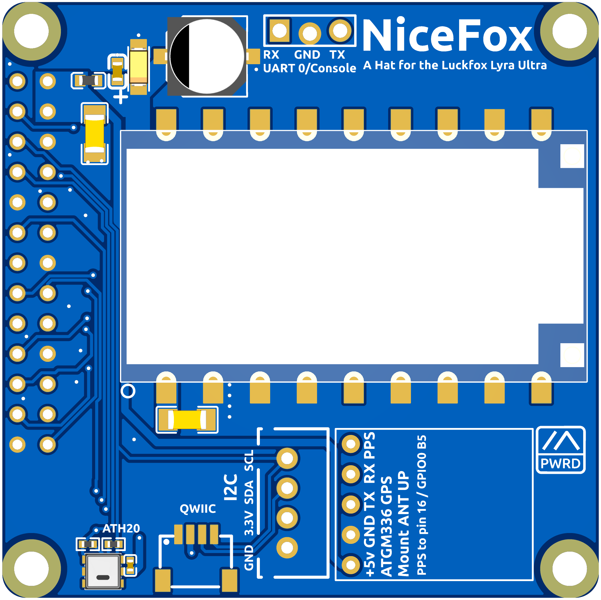
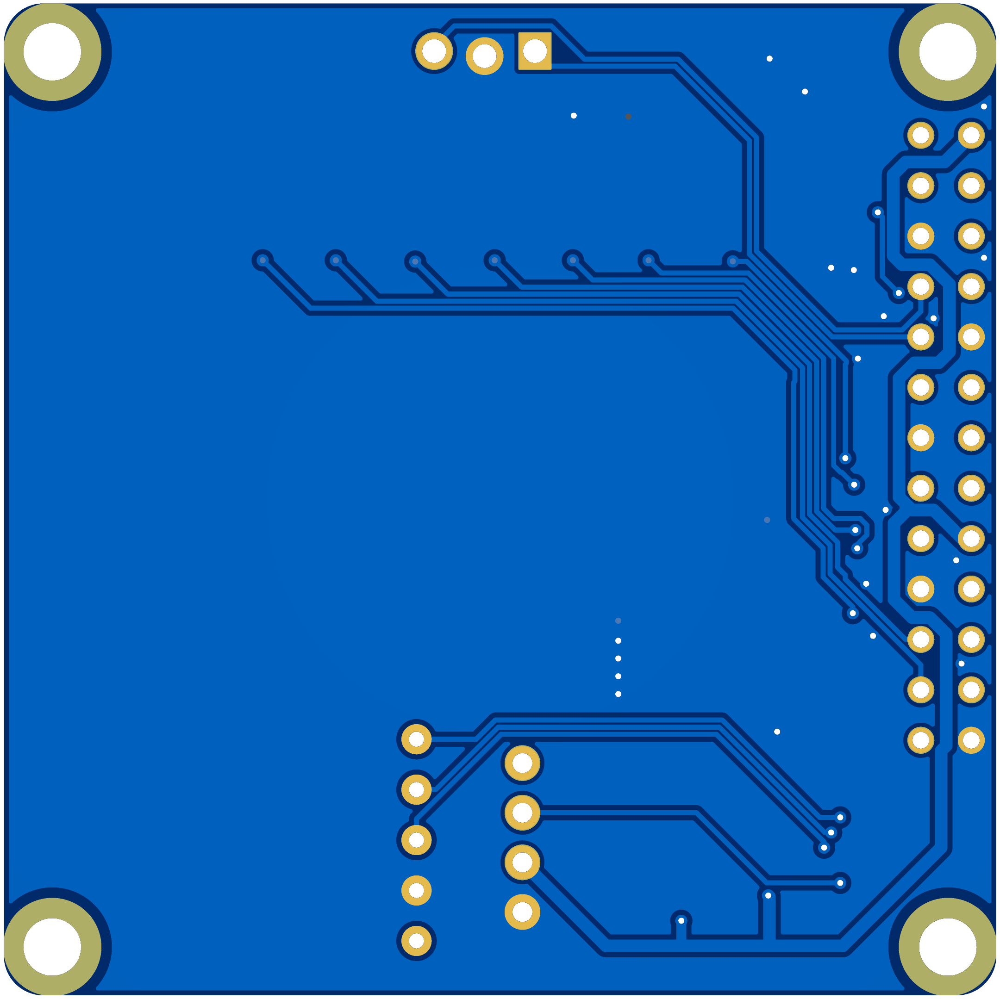

# NiceFox — NiceRF LR2021F33 Hat for LuckFox Ultra

A compact LoRa hat for the **LuckFox Pico Ultra** and **LuckFox Lyra Ultra** SBCs, carrying a NiceRF LR2021F33 (LR2021 / LR1121) 1–2 watt LoRa module and an AHT20 temperature/humidity sensor.

> [!WARNING]
> **The LR2021 module is not supported in any official Meshtastic release.** A custom build of `meshtasticd` is required. Use the code from [firmware PR #10567](https://github.com/meshtastic/firmware/pull/10567) and build from source.

---

## PCB

| Front | Rear |
|-------|------|
|  |  |

---

## Ordering PCBs from JLCPCB

The [PCB/](PCB/) directory contains all files needed to order assembled boards from [JLCPCB](https://jlcpcb.com).

### Files

| File | Purpose |
|------|---------|
| [Gerber_PCB1_2026-06-28.zip](PCB/Gerber_PCB1_2026-06-28.zip) | Gerber files for PCB fabrication |
| [Gerber_PCB1_2026-06-28.csv](PCB/Gerber_PCB1_2026-06-28.csv) | Bill of materials for JLCPCB SMT assembly |
| [PickAndPlace_PCB1_2026-06-28.csv](PCB/PickAndPlace_PCB1_2026-06-28.csv) | Component placement file for SMT assembly |

### Steps

1. Go to [jlcpcb.com](https://jlcpcb.com) and click **Order Now**.
2. Upload `Gerber_PCB1_2026-06-28.zip`. JLCPCB will auto-detect the board dimensions.
3. Set your desired quantity and any stack-up/colour preferences (defaults are fine).
4. Enable **PCB Assembly (PCBA)** and select **Standard PCBA**.
5. Upload `Gerber_PCB1_2026-06-28.csv` and `PickAndPlace_PCB1_2026-06-28.csv` when prompted.
6. Confirm component matches — all parts are sourced from LCSC and should resolve automatically.
7. Review the component placement preview, then proceed to checkout.

> **Note:** The NiceRF LR2021F33 radio module is **not available at JLCPCB** and must be soldered by the end user. The module uses a castellated SMD footprint suitable for reflow on a hotplate. Order directly from NiceRF or search for **"LR2021F33"** on AliExpress.

> **Note:** The recommended HAT connector is the **Samtec ESW-113-23-T-D** (DigiKey: [ESW-113-23-T-D-ND](https://www.digikey.com/en/products?keywords=ESW-113-23-T-D-ND)). This is not stocked at JLCPCB and must be ordered separately and hand-soldered.

---

## Platform Setup

SPI must be enabled on the LuckFox before use.

### Ubuntu (luckfox-config)

Configure SPI0 with the following pin mapping: CS=10, CLK=8, MOSI=6, MISO=7. Maximum SPI speed: 2 MHz.

### Armbian (armbian-config)

Enable the overlay `luckfox-lyra-ultra-w-spi0-cs0-spidev` via `armbian-config`.

---

## Radio Configuration

Copy the YAML config to your Meshtastic config directory:

| File | Compatible boards |
|------|-------------------|
| [lora-lyra-ultra-LoRa2021F33.yaml](lora-lyra-ultra-LoRa2021F33.yaml) | luckfox-pico-ultra, luckfox-lyra-ultra |

**Pin assignments:**

| Signal | Pin |
|--------|-----|
| CS     | 10  |
| IRQ    | 5   |
| Busy   | 11  |
| Reset  | 9   |
| SPI    | spidev0.0 |

---

## Schematic

[SCH_Schematic1_2026-06-28.pdf](SCH_Schematic1_2026-06-28.pdf)

---

## License

This work is licensed under **[Creative Commons Attribution-NonCommercial-ShareAlike 4.0 International (CC BY-NC-SA 4.0)](../LICENSE.md)**.

**Commercial use of these designs is not permitted.** You are free to build, modify, and share them for personal and non-commercial purposes, provided you credit the original author and license any derivatives under the same terms.

